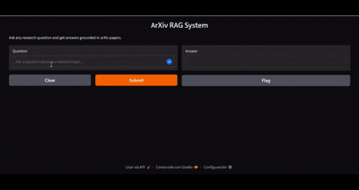

# ArXiv RAG System

End-to-end RAG pipeline for semantic search and Q&A over arXiv papers, spanning topics from NLP to astronomy.

---

## Demo



## Pipeline

Loader → Embedder → FAISS Index → Retriever → Reranker → PDFProcessor → Generator

## Dataset

[arXiv metadata snapshot](https://www.kaggle.com/datasets/Cornell-University/arxiv) (not included). Place it at `Data/arxiv-metadata-oai-snapshot.json`.

## Setup

```bash
pip install -r requirements.txt
export HF_TOKEN=your_token_here
export OPENAI_API_KEY=your_key_here  # only for evaluation
```

## Usage

```bash
# Run test queries
python main.py

# Run Gradio demo
python main.py --demo

# Run RAGAS evaluation (requires eval_results.json)
python eval.py
```

## Docker

```bash
docker build -t arxiv-rag .
docker run --gpus all arxiv-rag
```

## How it works

1. **Loader** — reads and parses title + abstract from the arXiv snapshot
2. **Embedder** — encodes abstracts with `BAAI/bge-base-en-v1.5`
3. **FAISS Index** — flat cosine similarity index over all abstracts
4. **Retriever** — retrieves top-50 candidates, deduplicating by paper ID
5. **Reranker** — CrossEncoder reranks candidates and selects top-3
6. **PDFProcessor** — downloads full PDFs from arXiv and retrieves top-5 relevant chunks per paper
7. **Generator** — Qwen2.5-7B-Instruct generates answers with numbered citations

## Evaluation

Evaluated with RAGAS (faithfulness + answer relevancy) over 20 queries spanning 10+ arXiv subject areas (cs, math, physics, econ, stat, q-bio, eess, astro-ph, cond-mat, q-fin).

Full results: [eval_scores.csv](eval_scores.csv)

| Metric | Average Score |
|---|---|
| Faithfulness | 0.55 |
| Answer Relevancy | 0.95 |

## Models

- Embedding: `BAAI/bge-base-en-v1.5`
- Reranker: `cross-encoder/ms-marco-MiniLM-L-6-v2`
- Generation: `Qwen/Qwen2.5-7B-Instruct`